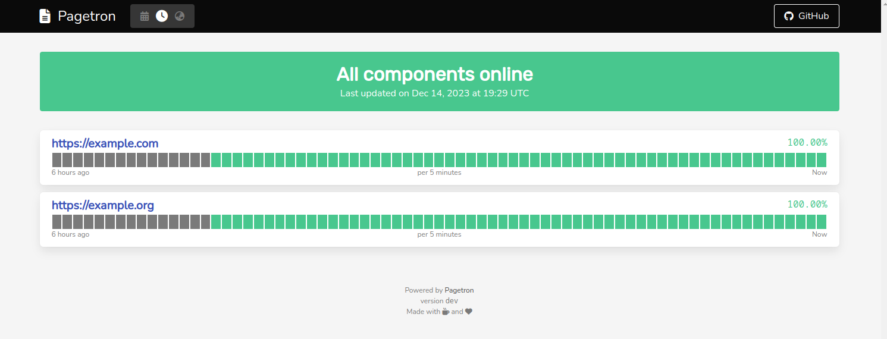

# Pagetron

Status page generator, based on Prometheus, designed to be deployed to Kubernetes clusters.

[Demo Page](https://pagetron-demo.agrrh.com/)



## About The Project

Uses well-known technologies

  - Kubernetes-ready
  - Prometheus under the hood

Built with modularity in mind

  - Use external metrics sources
  - Build your own UI

Free to use and extend

  - Released under [WTFPL](https://ru.wikipedia.org/wiki/WTFPL), one of most permissive licenses

<p align="right">(<a href="#readme-top">back to top</a>)</p>

## Getting Started

### Prerequisites

You must have Kubernetes cluster to be up and running to deploy this application in native way.

### Installation

At the moment, installation is as simple as:

```
helm repo add pagetron https://agrrh.github.io/pagetron/

helm install my-status-page pagetron/pagetron \
  --upgrade \
  --namespace pagetron \
  --values values.yaml
```

This will create some resources in your cluster:

- Namespace `"pagetron"`
- Configmaps
- Deployments
- PVC with default StorageClass
- Services
- ...

<p align="right">(<a href="#readme-top">back to top</a>)</p>

## Usage

Refer to wiki for [Quickstart](https://github.com/agrrh/pagetron/wiki#quickstart).

<p align="right">(<a href="#readme-top">back to top</a>)</p>

## Local Development

Recommended way is to use following tools:

1. [minikube](https://minikube.sigs.k8s.io/docs/) to provide local kubernetes cluster

    ```shell
    minikube start
    minikube addons enable ingress
    ```

2. [skaffold](https://skaffold.dev) to run local code in cluster with efficient feedback loop

    ```shell
    ${EDITOR} charts/pagetron/values.dev.yaml
    skaffold dev
    ```

3. Simply visit `publicUrl`.

<p align="right">(<a href="#readme-top">back to top</a>)</p>

## Roadmap

- [x] [Prototype Stage](https://github.com/agrrh/pagetron/milestone/1)
- [x] [Core Features](https://github.com/agrrh/pagetron/milestone/2)
- [ ] [Nice To Have](https://github.com/agrrh/pagetron/milestone/3)

See the [open issues](https://github.com/agrrh/pagetron/issues) for a full list of proposed features (and known issues).

<p align="right">(<a href="#readme-top">back to top</a>)</p>

## Contributing

Contributions are what make the open source community such an amazing place to learn, inspire, and create. Any contributions you make are **greatly appreciated**.

If you have a suggestion that would make this better, please fork the repo and create a pull request. You can also simply open an issue with the tag "enhancement".
Don't forget to give the project a star! Thanks again!

1. Fork the Project
2. Create your Feature Branch (`git checkout -b feat/some-useful-stuff`)
3. Commit your Changes (`git commit -m 'Add some useful stuff'`)
4. Push to the Branch (`git push origin feat/some-useful-stuff`)
5. Open a Pull Request

<p align="right">(<a href="#readme-top">back to top</a>)</p>

## License

Distributed under the [WTFPL](https://wikipedia.org/wiki/WTFPL) License. See [LICENSE.md](LICENSE.md) for more information.

<p align="right">(<a href="#readme-top">back to top</a>)</p>

## Contacts

Project Link: [https://github.com/agrrh/pagetron](https://github.com/agrrh/pagetron)

<p align="right">(<a href="#readme-top">back to top</a>)</p>

## Acknowledgments

Some inspiration from great services:

- [Better Stack](https://betterstack.com)
- [OneUptime](https://oneuptime.com)

<p align="right">(<a href="#readme-top">back to top</a>)</p>
