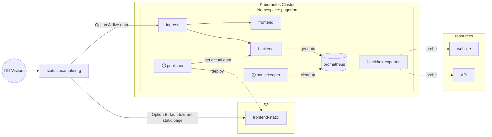

# Architecture

```mermaid
graph LR

visitor(("👨👩 Visitors"))
domain["status.example.org"]

subgraph resources
  external-website[website]
  external-api[API]
end

subgraph s3[S3]
  frontend-static
end

subgraph kubernetes["Kubernetes Cluster"]
  subgraph pagetron["Namespace: pagetron"]
    ingress

    frontend
    backend

    prometheus[(prometheus)]
    blackbox[blackbox-exporter]

    housekeeper["🕐 housekeeper"]
    publisher["🕐 publisher"]
  end
end

prometheus -.- blackbox
blackbox -.->  |probe| external-website & external-api

backend -.-> |get data| prometheus

housekeeper -.->|cleanup| prometheus

visitor --> domain
domain -->|Option A: live data| ingress --> frontend & backend
domain -->|Option B: fault-tolerant static page| frontend-static

publisher -.->|get actual data| backend
publisher -.->|deploy| frontend-static
```
