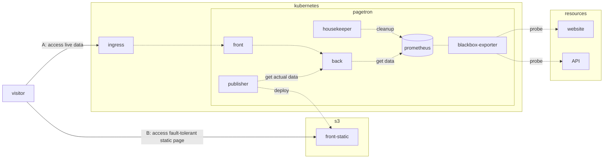

# Architecture

```mermaid
graph LR

visitor

subgraph resources
  external-website[website]
  external-api[API]
end

subgraph s3
  front-static
end

subgraph kubernetes
  ingress

  subgraph pagetron
    front
    back

    prometheus[(prometheus)]
    blackbox[blackbox-exporter]

    housekeeper
    publisher
  end
end

prometheus -.- blackbox
blackbox -.->  |probe| external-website & external-api

housekeeper -.->|cleanup| prometheus

front -.-> back
back -.-> |get data| prometheus

publisher -.->|get actual data| back
publisher -.->|deploy| front-static

visitor -->|A: access live data| ingress -.-> front
visitor -->|B: access fault-tolerant static page| front-static
```
